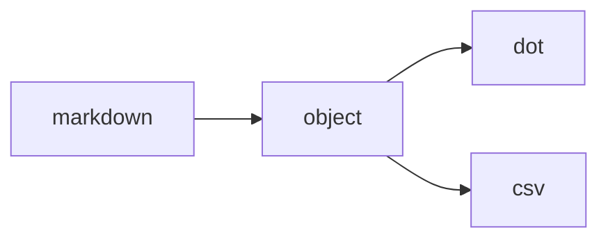

# Transformation Service

The transformation service provides a flexible system for converting between different views of data models. It uses a repository pattern with DynamoDB for configuration and a plugin architecture for implementations.

## Overview

The system supports:
- Multiple object types (e.g., 'itrg-bra')
- Multiple views (e.g., markdown, object, dot, csv)
- Automatic chaining of transformations
- Customizable transformer implementations
- Configuration via DynamoDB

## Case Study: ITRG-BRA Model

The ITRG-BRA (IT Reference Group - Business Reference Architecture) model demonstrates the system's capabilities:

### Available Views


### Example: Markdown to DOT Graph

1. **Input**: Call the API with markdown

```bash
POST /latest/services/transform/itrg-bra/markdown/dot
{
"content": "# Reference Architecture\n## VS1: Business Development\n### L1: Market Analysis\n- Description here\n#### L2: Competitor Analysis\n- Details here"
}
```

2. **Transformation Chain**:
   - System detects no direct markdown→dot transformer
   - Finds path: markdown→object→dot
   - Executes transformers in sequence

3. **DynamoDB Configuration**:
```json
// transformer#itrg-bra#markdown_object
{
    "userId": "system",
    "typeName": "transformer",
    "dataType": "transformer",
    "objectType": "itrg-bra",
    "fromView": "markdown",
    "toView": "object",
    "transformerDetails": {
        "type": "utility",
        "language": "typescript",
        "customizable": false
    }
}

// transformer#itrg-bra#object_dot
{
    "userId": "system",
    "typeName": "transformer",
    "dataType": "transformer",
    "objectType": "itrg-bra",
    "fromView": "object",
    "toView": "dot",
    "transformerDetails": {
        "type": "utility",
        "language": "typescript",
        "customizable": false
    }
}
```

4. **Implementation Mapping**:
```typescript
const transformerImplementations = {
    'itrg-bra': {
        'markdown-object': parseMarkdown,
        'object-dot': generateDotGraph,
        'object-csv': generateCsv
    }
};
```

## Adding New Transformers

The transformer system follows a specific file organization pattern:

```
brainsOS/
└── config/
    └── transformers/
        └── {objectType}/         # e.g., itrg-bra/
            ├── md-object.tsx     # markdown -> object transformer
            ├── object-dot.tsx    # object -> dot transformer
            ├── object-csv.tsx    # object -> csv transformer
            └── samples/          # test samples
                └── sampleInput.md
```

### Implementation Steps

1. **Create Object Directory**:
   Create a new directory under `config/transformers/` named after your object type:
   ```bash
   mkdir brainsOS/config/transformers/your-model
   ```

2. **Implement Transformers**:
   Create individual files for each transformer, following the naming pattern `{fromView}-{toView}.tsx`:

   ```typescript:config/transformers/your-model/md-object.tsx
   export function parseMarkdown(content: string): YourModelObject {
     // Implementation here
     return parsedObject;
   }
   ```

   ```typescript:config/transformers/your-model/object-dot.tsx
   export function generateDotGraph(object: YourModelObject): string {
     // Implementation here
     return dotGraph;
   }
   ```

3. **Register in defaultTransformers.json**:
   ```json:data/defaults/defaultTransformers.json
   {
     "objects": [
       {
         "objectType": "your-model",
         "tags": ["your-tags"],
         "transformers": [
           {
             "description": "Parse markdown into model object",
             "fromView": "markdown",
             "toView": "object",
             "transformerDetails": {
               "type": "utility",
               "language": "typescript",
               "customizable": false
             }
           }
         ]
       }
     ]
   }
   ```

4. **Add Implementation Mapping**:
   Update the transformer implementations map in your handler:

   ```typescript:functions/api/services/transform/transformHandler.tsx
   const transformerImplementations: { [key: string]: any } = {
     'itrg-bra': {
       'markdown-object': parseMarkdown,
       'object-dot': generateDotGraph
     },
     'your-model': {
       'markdown-object': yourParseMarkdown,
       'object-dot': yourGenerateDotGraph
     }
   };
   ```

### Example: ITRG-BRA Implementation

The ITRG-BRA model demonstrates this pattern:

```typescript:config/transformers/itrg-bra/md-object.tsx
export function parseMarkdown(content: string): ITRGObject {
  const tokens = marked.lexer(content);
  // Implementation details...
  return parsedObject;
}
```

```typescript:config/transformers/itrg-bra/object-dot.tsx
export function generateDotGraph(object: ITRGObject): string {
  // Implementation details...
  return dotGraph;
}
```

### Testing

1. Add sample inputs to the `samples/` directory
2. Test individual transformers:
   ```bash
   POST /latest/services/transform/your-model/markdown/object
   POST /latest/services/transform/your-model/object/dot
   ```
3. Test chained transformations:
   ```bash
   POST /latest/services/transform/your-model/markdown/dot
   ```

## Error Handling

The system provides detailed error messages for:
- Missing transformers
- Invalid transformation paths
- Implementation errors
- Invalid input formats

Example error:
```json
{
    "success": false,
    "metadata": {
        "processingTimeMs": 123,
        "objectType": "itrg-bra",
        "fromView": "markdown",
        "toView": "dot",
        "timestamp": "2024-01-20T12:00:00Z"
    },
    "error": {
        "code": "UNSUPPORTED_TRANSFORM",
        "message": "No transformation path found",
        "additionalInfo": "Check available transformers"
    }
}
```

## Future Enhancements

1. Support for more complex transformation chains
2. Validation of intermediate formats
3. Caching of common transformations
4. Performance metrics and optimization
5. GUI for transformer configuration
6. Support for async transformations