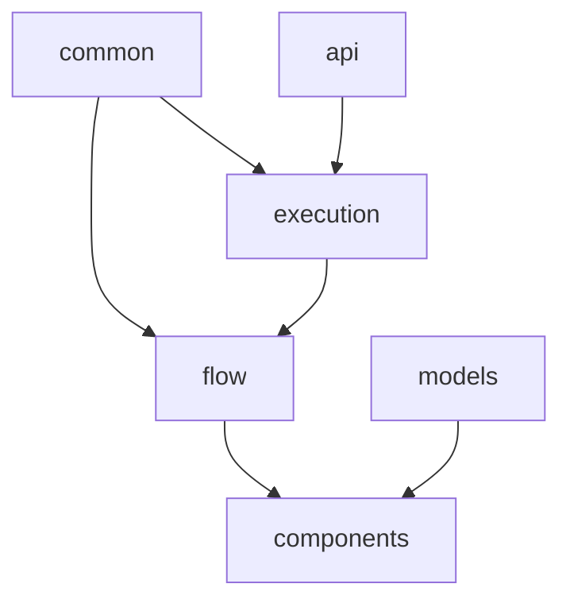

# Type System Organization

The type system has been organized into logical modules to improve maintainability and clarity. Each module has a specific focus and clear dependencies.

## Core Modules

### `flow.ts`
- Core flow-related types
- Node and edge structures
- Flow data and metadata
- Independent of any visualization library
- **Key types**: `FlowNode`, `FlowEdge`, `FlowData`, `BaseNodeData`

### `execution.ts`
- Execution-related types
- Error handling
- Results and contexts
- **Key types**: `ExecutionContext`, `NodeExecutionResult`, `ExecutionError`

### `api.ts`
- API-related types
- Response structures
- Error handling
- **Key types**: `APIResponse<T>`, `APIError`, `PromptResponseData`

### `models.ts`
- Language model types
- Model configuration
- **Key types**: `LLM`, `LLMResponseData`

### `common.ts`
- Shared basic types
- Core interfaces
- **Key types**: `Position`, `Dimensions`, `NodeStatus`

### `components.ts`
- React component props
- UI-specific interfaces
- Extends core types with React-specific functionality
- **Key types**: `FlowEditorProps`, `PromptNodeProps`

## Type Dependencies



## Usage

All types are re-exported through `index.ts`. Components should import from this central location:

```typescript
import { 
    FlowData,
    NodeExecutionResult,
    PromptNodeProps,
    // etc...
} from '../types';
```

## Design Principles

1. **Separation of Concerns**
   - Core flow types are independent of UI
   - React-specific types extend core types
   - Clear boundaries between domains

2. **Single Source of Truth**
   - Each type is defined in exactly one place
   - All imports go through index.ts
   - No circular dependencies

3. **Progressive Enhancement**
   - Base types are UI-agnostic
   - UI layers add functionality through extension
   - Clear upgrade path for new features

4. **Type Safety**
   - Strict type checking throughout
   - Explicit error types
   - Comprehensive interface definitions
